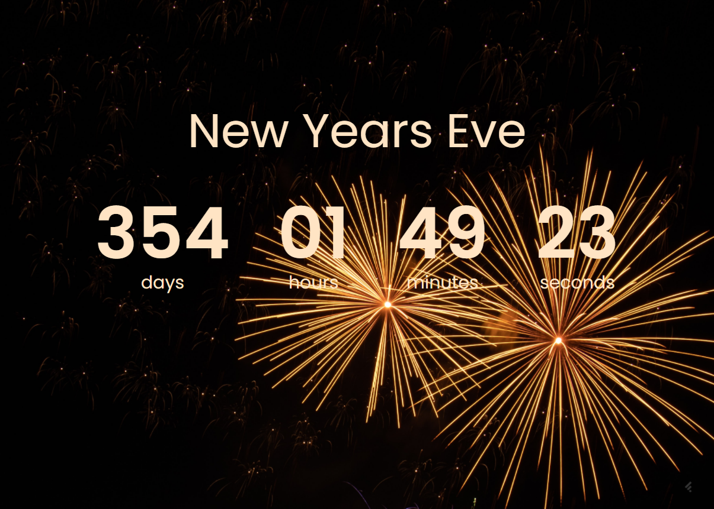

#Countdown Timer to 2023

This web application provides a countdown to 2023, but can be used as a countdown to any other special date you may be looking forward to. I created this project as a part of the #100DaysOfCode challenge where I have made it a goal to code for 100 days consecutively. 

##How to Install
1. Download this repository
2. Open the index.html with a Live Server

###Credits
- Design Inspo: https://www.uidesigndaily.com/posts/sketch-countdown-timer-day-876
- 10 Javascript Projects in 10 Hours - Coding Challenge https://youtu.be/dtKciwk_si4